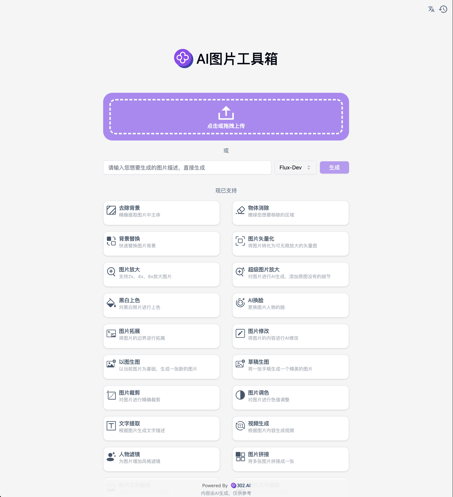

# 🖼️ AI 图片工具箱 🚀✨

AI图片工具箱提供了各种丰富的AI处理图片功能，还可以连续进行链式操作。

<a href="README.md">中文</a> | <a href="README_en.md">English</a> | <a href="README_ja.md">日本語</a>

这是来自[302.AI](https://302.ai)的[AI图片工具箱](https://302.ai/product/detail/29)开源版本。你可以直接登录302.AI，零代码零基础使用在线版本，或根据自己的需求修改并自行部署。

## 界面预览
可通过上传图片或输入描述，选择模型生成图片后进行图片处理，多种图片处理功能可供选择。

以去除背景功能为例，根据上传的图片，AI自动识别背景并去除。

## 项目特性
### 🎥 AI图片工具箱
  支持多种图片操作，包括拓展功能文字生图跟图片转视频。
### 🖼️ 功能一应俱全
  包括去除背景、物体消除、背景替换、图片矢量化、图片放大、超级图片放大、黑白图片上色、AI换脸、图片扩展、图片修改、以图生图、草稿生图、图片裁剪、图片调色、图片拼接、人物滤镜等功能。
### 🔄 任务管理
  任务支持重新生成，链式调用各种工具，历史回滚再次编辑。
### ⚙️ 多模型支持
  可选择各种模型生成图片跟视频。
### 📜 历史记录
  保存您的创作历史,记忆不丢失，随时随地都可以下载。
### 🌍 多语言支持
  - 中文界面
  - English Interface
  - 日本語インターフェース

## 🚩 未来更新计划
- [ ] 新增特效、图像修复、图像合成等功能

## 技术栈

- Next.js 14 基础框架
- Tailwind CSS + Shadcn UI 样式UI
- Zustand 作为数据管理

## 开发&部署

1. 克隆项目 `git clone https://github.com/xiaomizhoubaobei/image_toolbox.git`
2. 安装依赖 `yarn install`
3. 配置302的API KEY 参考.env.example
4. 运行项目 `yarn run dev`
5. 打包部署 `docker build -t image-toolbox . && docker run -p 3000:3000 image-toolbox`
